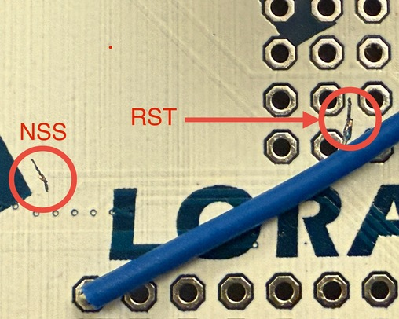
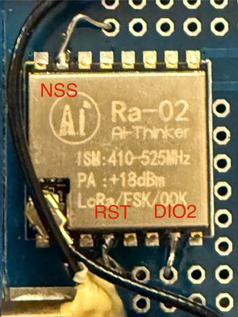

# SX127x reference

This is a repo for SX127x RF examples, hardware hacking, etc. Currently this uses no libraries, so an understanding can be obtained (trying to find a minimal, clear example is painful). No examples are available for LoRa yet - only FSK/OOK.

The two examples at present are:
- Continuous mode, OOK (e.g. "raw" data sampled over DIO2)
  - Use of interrupts on DIO0 (RSSI threshold interrupt)
  - Creating a ESP32/FreeRTOS task to service DIO2 and wait out the transmission
  - Queues to pass data between tasks
- Packet mode, FSK (Interrupt on DIO0, data via SPI FIFO accesses)

Hardware used:
- [M5Stack LoRa433 v1.0 (Protoboard version)](https://docs.m5stack.com/en/module/lora)
- [M5Stack LoRa868 v1.1 (DIP-switch version)](https://docs.m5stack.com/en/module/Module-LoRa868_V1.1)

## Hardware hacking notes

**Doing this will invalidate any warranty**

If looking at a M5Stack Core implementation, the LORA433 v1.0 with protoboard makes it easy to reassign the chip outputs to alternative MBUS GPIO pins by passing wires through the protoboard holes to the male pins on the other side.

Why would someone do this? It is possible reroute the pins in scenarios where:
- Pins conflict - such as with a M5Stack PoE Base (RX & IRQ pins clash with NSS & RST)
- LoRa433 v1.1 may not offer a DIP setup without pin clashes (e.g. with a CoreS3 + LoRa868 v1.1 + PoE Base)
- A new input is needed (i.e. raw sampled data over DIO2)

Here is what was changed on a LORA433 v1.0:
- NSS reassignment to another pin:
  - cut the surface trace nearest the bottom of the left leg of the imprinted "M"
  - solder 2nd castellation on row **furthest** from antenna,
- RST reassignment to another pin:
  - cut the surface trace running horizontally between the two rows of solder points above "LORA"
  - solder 4th castellation on row **nearest** from antenna
- DIO2 addition (for raw data):
  - solder 7th castellation on row **nearest** from antenna

Cutting the traces requires a magnifying glass, sharp blade and a steady hand. Visual details below:

